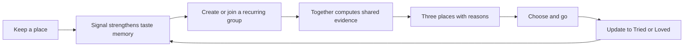

# this.is — UX architecture

**Status:** working product contract  
**Date:** July 10, 2026  
**Companion:** [Product reset](./THIS_IS_RESET.md)

> **Group amendment, July 11:** [`GROUP_DIRECTION.md`](./GROUP_DIRECTION.md) supersedes pair-only
> scope below. Persistent groups of 2–6 are now the primary relationship object; a pair is the
> smallest valid group. Historical pair references remain only for migration, control-cohort, or
> implementation-foundation evidence; the operative journeys and screen laws below are group-native.

## The decision

this.is is not a social map. It is the shared-taste memory for the people you actually make plans with.

> **Find the place your people already agree on.**

The product earns a place on the phone by remembering small signals over time, revealing the useful overlap between specific people, and reducing a night-out decision to a few candidates with legible reasons. The map is a view. Lists are storage. The relationship is the product.

## Why this position survives the market

| Product pattern | What it owns | Why this.is must not imitate it |
|---|---|---|
| Google / Apple Maps | universal place utility, routing, breadth | this.is cannot out-index or out-navigate an operating-system map |
| Corner | culturally relevant discovery and curator-led social map | a younger-looking discovery map is still a discovery map |
| Beli | restaurant tracking, ranking, and friend activity | ratings and leaderboards turn taste into performance |
| Mapstr | personal place archive, tags, friend maps, collaborative maps | Mapstr already exposes “places in common”; overlap as a filter is not a moat |
| Swipe / voting apps | synchronous group choice | they create a fresh chore every time and discard the group’s accumulated history |
| Spotify Blend | automatic relationship artifact built from behavior | this is the useful adjacent model: the shared result appears without manual curation |

The distinct center of gravity is:

1. **A named relationship:** “You & Vivian,” not “your network.”
2. **Longitudinal evidence:** prior Wants, Trieds, Loves, and notes—not a new ballot.
3. **Reciprocal discovery:** what you share, where they can take you, and where you can take them.
4. **Decision closure:** three candidates with reasons, then a lightweight commitment.
5. **Private-by-default intimacy:** no follower count, public taste score, or performative feed.

## Product nouns

Keep the model small. Every visible feature must attach to one of these nouns.

### Person

A real human with a private taste history. A person has identity, explicit group memberships, and
place signals. There is no global influence score or public taste profile in the product experience.

### Group

An intentionally small, recurring set of 2–6 trusted people. A group has consented membership and an
explicit audience for each shared signal. It persists long enough for useful taste evidence to
accumulate. A pair is simply a two-member group; “connection,” “following,” and all-connections
`circle` visibility are implementation legacy, not current product language.

### Place

A provider identity may help capture or open Maps, but durable personal memory is user-confirmed:
label, category, optional place-specific area, note, and Want/Tried/Loved state. Google facts are
cost-controlled, attribution-carrying, and fetched only at reviewed boundaries; they do not become a
silent durable catalog or location profile.

### Signal

The atomic edge between a person and a place:

```text
person × place × state × optional note × timestamp
```

State is exactly one of:

- **Want** — credible future intent.
- **Tried** — a memory without a strong endorsement.
- **Loved** — a recommendation the person is willing to stand behind.

A short note records context in the person’s own language. No stars. No mandatory review.

### Together view

A computed group decision artifact, not another collection to maintain. It contains at most three
known matches, named member introductions, or bounded weak fits with compact reasons derived only from
current attendees' explicitly group-visible evidence. Unknown people remain unknown.

### Pick

A temporary decision object: people, candidate places, bounded current-plan context, selected place,
and outcome. Confirmed area or practical need may remain on the private Pick so the choice still
makes sense after navigation, but never becomes saved taste, a reusable default, or public receipt
content. It exists to close the loop, not to become a project-management surface.

One group exposes at most one selected Pick. Together may label that group with its current place,
and opening the group replaces a competing draft with a single recovery action. This is a bounded
pointer, not a Pick feed or history screen. Visiting, dismissing, or changing membership clears it.

## Information architecture

The primary dock has three destinations.

### Together

The front door. It begins with people, not a generic feed.

- A group with a current Pick leads as a recovery task; otherwise input order remains stable.
- Ordinary active groups receive equal treatment. Array position alone never creates visual prominence.
- Group-index summaries use only authoritative state: current Pick, Last Pick, forming, or the exact
  number of group projections. They never imply that every group already has usable taste history.
- A cold group-directory failure reveals no group identity. A background refresh failure preserves
  the last authorized groups below an explicit stale warning, while retired pair-migration failure is
  secondary recovery and can never replace or obscure canonical groups.
- Pair retirement is a desired-state handoff to one deterministic two-person group. A lost response
  changes only the affected row to **Check group**, focuses that action, freezes competing migrations,
  and states that checking cannot add a person or move private places or notes. Exact server replay
  performs no second write; success opens the authoritative group instead of fabricating an intermediate
  migrated state in Together.
- An active group with no truthful candidate leads with the honest empty state and its smallest remedy;
  it does not show the amber three-place promise above an answer it cannot currently produce.
- Attendee and plan controls remain available after that remedy. When a temporary filter hides
  otherwise available candidates, controls stay first because changing the draft is the recovery.
- The amber shortlist heading states the exact visible count: one place / a real reason, two places,
  or three places. Passing or filtering a candidate updates the promise; zero removes it.
- A relationship opens directly into a computed Together view.
- A compact “make a plan” affordance appears only when there is enough evidence.
- New signals are surfaced as “you now have 2 more places in common,” not social-content notifications.

### Keep

The user’s taste memory and capture utility.

- Search for one place or receive one share-sheet handoff; review it before saving.
- A future user-initiated export import requires separate source, format, terms, and confirmation review
  and can never become an onboarding dependency.
- Apply Want, Tried, or Loved.
- Add an optional note.
- Filter by state.
- Keep card order must agree across sight, keyboard focus, and assistive technology; the two-column
  phone grid therefore places cards row by row rather than using CSS columns.
- Keep never treats pending or unavailable personal memory as an empty account. Initial loading uses
  a neutral skeleton; a cold read failure reveals no place count, label, note, or sharing state and
  leads only with retry. A warm refresh failure preserves the last authorized notebook with a compact
  stale warning afterward. Retry reuses the bounded query without polling or another listener.
- Render the person’s canonical memory directly: their label, category, optional place area, note,
  and state. A provider-shaped compatibility snapshot is never required to show the card.
- Introduce that one memory to any exact current group through a row that separately names the group,
  states **Shared** or **Not shared**, and labels the available action **Share place** or **Stop sharing**.
  A state label must never conceal the removal action.
- After a successful non-group Add capture, Want or Loved remains canonical private memory and the save
  toast offers **Review sharing**. That handoff reopens the user-confirmed memory without Place Details,
  focuses its named active-group rows, and requires a separate explicit choice for every group. It never
  infers an audience, auto-shares, or widens the canonical save; explicit removal deletes only the chosen
  server-owned projection.
- Keep the personal place route personal. It may show the person's own memory and exact per-group
  sharing controls, but never merge connection-circle or multiple-group member signals under an
  unscoped “your people” label. Member evidence belongs inside its named Together group or Pick reason.
- If frozen connection-circle cleanup may have committed but its response is lost, retain the older
  sharing region as unknown and focus one **Check privacy** action. Pause tag, memory, note, useful-detail,
  group-projection, and deletion changes until exact retry confirms the desired private state; do not
  relabel the note private early or imply Keep/group projections were removed.
- Apply that exact recovery model to every Keep write. Tags retain the last confirmed pressed state;
  memory/note/useful-detail forms retain and lock the reviewed attempt; deletion retains the place until
  **Check removal** confirms absence. Identical retries preserve the first taste timestamp and stored
  bytes. In Add and onboarding, **Check Keep** confirms the private save before a separate group share
  may start. A save-toast retag keeps its operation identity and recovery action after the toast changes.
- A cold personal-memory or private-Pick read is unavailable data, never proof that the place is
  missing. It reveals no saved place, group, attendee, reason, note, or sharing state and stops before
  Place Details. If a valid Pick has already supplied its durable authorized memory, the shared Pick
  may remain usable while a separate private-Keep warning withholds personal outcomes until retry.
- Open every resolved memory through a real place link; if an older save has no confirmed memory,
  show a bounded labeling recovery instead of silently substituting provider facts.
- Correct or delete a signal easily.

Keep should feel like a well-kept pocket notebook, not a content board.

### Personal discovery inside Keep

Discovery is an action inside Keep/Add, never a fourth primary tab or generic map. It begins with a
temporary area the person types, then orders four broad prompts from private Want/Loved category counts
computed locally. Tried is visit history rather than taste, empty history keeps the same broad prompts,
and no ordering state or search area is persisted. One prompt tap creates one transparent
category-plus-area autocomplete query; it does not trigger a background detail or photo fan-out.

When Places is disabled, the temporary area and broad prompts remain usable. One prompt produces and
focuses an **Explore in Google Maps** handoff; activating it opens a web search for exactly the
person-typed area/category query at zero this.is Places API cost. Google Maps receives only that explicit
query; this.is stores neither the area nor a result. The person chooses one exact place there, then shares
it to this.is or returns and pastes its exact Maps link. That returned identity enters the same review and
private-first confirmation path. On a return to that same live screen, the explicit kind and area may
prefill editable review fields from in-memory state; nothing is saved until confirmation. A cold exact
link or incoming share has no such context and must never inherit or infer either field. Exact-link review
does not make a background Place Details request. This handoff never reads device location, guesses a
current area, imports a result automatically, or creates a location profile.

When in-app autocomplete is available, the first result receives focus and scrolls above the dock. Selecting it is the explicit Details action
and shows only minimal live Google identity context before the existing memory review. Nothing reaches
Keep until the person confirms a label, category, optional place area, and Want/Tried/Loved. Personal
discovery defaults private. Group-launched discovery names the exact audience and may share only that
reviewed Want/Loved place; it never exposes the private saves that ordered the prompts.

When Group launches Discover for an in-progress plan, one App-owned in-memory draft may carry only the
selected attendees, anonymous-guest flag, Food/Drinks/Coffee context, explicit temporary area, and one
practical need. The continuity payload is never serialized into the URL, browser storage, Firestore, or
analytics. Discover pre-fills the area and visibly suggests the matching kind without issuing a provider
request; a search begins only after an explicit prompt tap. Returning to Group requires the same signed-in
member, exact group, `permissionVersion`, and current 2–6-member set, then consumes the draft and
recomputes candidates from current authorized evidence. Reload, membership/audience change, inactive
group state, or a current Pick resets it rather than restoring stale context.

### Profile identity recovery

A name or avatar is visible to current groups, so an unconfirmed response cannot be treated like a
cosmetic local preference. Settings retains the last confirmed name/avatar, states the exact attempted
change, focuses **Check profile**, and locks both identity controls. Exact retry is a no-op when the
desired fields already exist. Onboarding completion similarly preserves its first timestamp rather
than making a retry look like a later first use. If either the invite-driven identity write or ordinary
completion response is unknown, onboarding retains the exact reviewed identity and completion attempt,
focuses **Check setup**, and locks identity, optional Keep, group-join, and sharing actions. The check
can only confirm that same setup; profile recovery never changes membership or Keep.

### People

Group membership and relationship management.

- See each accepted member once, derived only from groups explicitly shared with you.
- Understand whether you share one group or several without inventing a public profile.
- Open one named shared group directly; never route through an arbitrary first group.
- A cold directory failure reveals no cached member or group identity and never masquerades as an
  empty account. A previously authorized warm directory may remain visible during a background error.
- Together and People revalidate the bounded group index whenever the directory is deliberately
  entered or the app regains focus. They do not poll or mount a second group listener.
- If every group still contains only the current person, show the truthful invitation next step instead
  of an empty directory: name the forming group, state that Keep remains private, and route to that
  group's one-person invite boundary.
- Create or accept group invitations through the relevant group boundary.

There is no Explore tab in MVP. Search happens inside the reviewed Add capture; it is not a separate
catalog or destination. Keep and unavailable-place recovery enter Add directly. Historical `/search`
links redirect there with their query parameters intact, so old handoffs recover without preserving a
fixture-only local catalog.

## The core loop



The loop must still provide value when only one attendee contributes. One explicitly shared Love can
become a named member introduction while every other attendee remains visibly unknown.

Once a group has a current Pick, that Pick replaces the shortlist promise and leads the group page.
Audience and privacy detail remains visible beneath it, but the chosen place and its recovery action
must not sit below stale planning copy or a second draft.

Candidate cards lead with the exact group reason, member attribution, and unknown facts. Field-level
provenance remains available through a readable **How this card knows** disclosure rather than
permanently occupying the card in microtype. Both that disclosure and **Not for us** must remain
independent, touch-sized controls; hiding provenance must never be required to make room for passing.

## Critical journeys

### 1. First group: join without implied consent or place homework

The creator's first form names the group, so its page heading must ask for a group name—not ask them to
name people while presenting no people controls. It uses the name already familiar in chat, keeps the
invite-everyone-first sequence visible, states that creating or joining never exposes personal Keep,
and warns before creation that the organizer will make a separate private link for each person. The
creation action remains unavailable until a valid name is entered.

1. An existing person creates a random, revocable, one-person invitation token containing no place
   history and only a bounded inviter name/avatar snapshot. It expires after seven days and can be
   accepted once. Before the first token is created, the organizer view must say **One link · one
   person**, explain that a separate link is required for everyone, and label the action **Make
   one-person link**. This prevents one consumed link from being mistaken for a whole-group chat
   invitation. After creation, the view leads with Copy / Share / Cancel and does not print the opaque
   token by default; a touch-sized **Show full link** disclosure preserves exact manual-copy recovery.
2. The recipient sees who invited them, the historical member count from link creation, and the exact
   privacy promise before sign-in.
3. A new recipient establishes only the name/avatar needed for recognizable membership, then returns
   directly to the invitation. Pre-membership onboarding must not ask for a private place immediately
   before the group asks for an optional contribution it can actually use.
4. The recipient explicitly chooses **Join group**; merely opening or authenticating changes no
   membership or taste audience.
5. Token claim and member-scoped group acceptance commit atomically; a failed or replayed claim creates
   neither partial membership nor a second relationship.
6. Land on that exact group, where Quick start, Choose or find a place, and Not now form the one optional
   contribution decision. This is the first place prompt in an invitation journey.

**Choose or find a place** starts with continuity, not recall homework. In group-scoped Add, the member
may see at most three of their own resolved private Want/Loved memories under **From your Keep - only
you**. Loved precedes Want, then newer memories precede older ones, with stable ordering for ties. When
the current plan explicitly supplies category and/or area, every supplied filter must match known memory;
unknown does not count as fit. Otherwise any resolved private Want/Loved memory is eligible. The bridge
never shows private notes or useful-detail observations, never shares on open, and makes no provider
request. Opening a memory reaches the existing place sheet with the exact named-group share row. Only a
successful explicit share to that same still-active group returns to it; other edits and generic sharing
visits keep ordinary Closeup navigation.

Target: the recipient understands who invited them, what becomes visible, that Keep stays private, and
how to leave before membership is created. More signals improve results, but joining never requires
place homework and no abstract taste quiz or fabricated seed data may stand in for real history.
Ordinary non-invite onboarding may still offer an optional private Keep seed; zero must never read as unfinished work there either.
The global first-use gate redirects only after a successful profile read proves `onboardedAt` is
absent. A failed read is unknown and stays on the requested destination while the normal query recovery
runs; it must never masquerade as incomplete onboarding.

Invite consent has three distinct read boundaries. A failed token lookup says only that the app could
not check the link, reveals no group or inviter identity, and offers an exact retry. A successful null
lookup may say the link is expired, used, or otherwise unavailable. After a valid preview loads, a
failed signed-in profile read may retain that preview but must pause acceptance; it cannot treat unknown
profile data as incomplete onboarding or offer Join until the account check succeeds.

Group creation is one retry-safe operation, not a repeatable write. The client creates one opaque
operation key for the reviewed name and retains it across ambiguous-response retries; editing the name
starts a new operation. The authenticated server derives one owner-scoped, non-enumerable group ID and
returns the same group on replay. While authentication is unresolved, the route shows neither the
creation form nor the signed-out prompt. A failed response preserves the reviewed name, states that no
confirmed result was received, and offers the same operation again rather than encouraging a duplicate.

Making an invite follows the same law at the one-seat boundary. One deliberate action owns one opaque
operation key, retained in session storage only while its response is unresolved. The server derives
one creator/group-scoped token and returns that active token on replay before applying seat-capacity
checks. A response retry therefore cannot reserve a second seat. A successful response clears the
pending operation so **Make link for someone else** remains a genuinely new action; if a recovered link
was already visible, the UI says the retry recovered it instead of implying another link was made.

Revoking an unused invite is also exact and retry-safe. Only its creator, while still a current group
member, may replay that creator-revoked token; replay succeeds without changing its original audit
timestamp. Every other account, consumed token, and system-revoked reason remains unavailable. If the
response is ambiguous, the affected card removes Copy, Share, Cancel, and the full-link disclosure and
offers only **Check link**. The recovery copy says checking can only revoke the same link and cannot
restore or replace it. While its dialog is open, background token actions leave the accessibility tree;
the unknown response focuses **Close for now**, and closing focuses the single Check action.

Accepting that link is also replay-safe. Once the trusted transaction records `acceptedBy` and adds the
member, the same authenticated recipient may replay the exact token only while they remain a current
member; the server returns the original group without adding another member. Every other recipient,
revoked link, or former member remains denied. If the response is ambiguous, the consent action becomes
**Check membership**, not another Join. On reload, only that accepted current member may read the bounded
snapshot and sees **You already joined** with one Open group action; guests and other accounts learn
nothing from the consumed token.

Leaving follows the same exact-operation principle while preserving personal ownership. The trusted
endpoint means **ensure I am no longer a member**: the first successful call removes that member's
group projections and repairs or closes the surviving group; an exact retry after membership is gone
is a no-op success. A non-member cannot trigger cleanup or learn group state through this boundary.
If the response is ambiguous, the dialog changes from **Confirm leave** to **Check membership** and
states that checking can only finish leaving; it cannot rejoin the person or remove personal Keep.
Closing recovery focuses that single check action and must not restore a fresh Leave action or claim
that nothing changed.

On the optional Quick start screen, broad place kinds that can affect today's weak-fit reason remain
primary. Practical constraints retained for future retrieval sit behind a collapsed, touch-sized
**Optional for later** disclosure and explicitly say they do not change current suggestions. **Not now**
remains fully visible in the initial joining viewport; future inputs may never be staged as required work.

Saving or removing Quick start is retry-safe without becoming a second taste store. The server treats
an identical saved preference and an already-absent preference as no-op success, preserving document
timestamps on exact replay. After an ambiguous response, every hint control freezes on the reviewed
state and the action becomes **Check hint** or **Check removal**. Copy states that checking cannot
reopen invitations, share a place from Keep, or remove personal Keep. **Close for now** leads directly
to the group so its authoritative audience state is visible; reopening Quick start restores only the
operation kind from development session state and derives any committed choices from the authorized
group projection.

Do not ask for abstract “vibes,” cuisine quizzes, or a public profile before value appears.

### 2. Capture: turn a fleeting recommendation into a durable signal

1. Tap Add place from Together or Keep.
2. Paste a Google Maps link or type a name. Before input, explain that autocomplete waits for three
   letters and that selecting a result opens review rather than saving; opening this state makes no
   resolver or Places request. When search is disabled, retain both the explicit temporary-area/category
   Google Maps handoff and the exact-link input: the former helps the person find an idea without an app
   API call, and the latter brings one exact choice back for review rather than leaving Add at a dead end.
3. Search with restrained Places fields and session-aware autocomplete. Resolve a pasted link only
   after an explicit tap. If the long or resolved URL already carries an exact supported Place ID,
   open review from that identity without Place Details; any readable URL label is merely an editable
   seed. A cold exact link or incoming share supplies no kind or area and cannot inherit or infer either.
   Only a return to the same live Discover screen may carry its still-in-memory, person-chosen kind and
   area into editable review fields; this creates no save before confirmation and no background Place
   Details request. A readable link without exact identity may become autocomplete input only when search
   is enabled. Coordinates alone always fail closed.
4. Review the person's own label, explicitly choose one broad place kind with no provider-derived or
   inferred default; the only allowed prefill is a kind the person already chose in the same live Discover
   flow. Then explicitly choose Want, Tried, or Loved with no default experience. Optional
   user-typed area stays collapsed until requested and follows the experience decision. When capture began
   inside a group, resolve and name that exact authorized group before the optional area disclosure.
   A bare Tried records personal history but does not enter that group: it is not support and must not
   pretend to create a candidate. Want or Loved is required to introduce the place from this flow.
   A pending lookup says it is checking the group. A cold query failure reveals no group name, mounts
   no provider capture, and offers retry; a successful null lookup separately says the group is no
   longer available. Both stop before confirmation and never disguise failed group capture as a
   successful private save.
5. Optionally add one sentence: “quiet enough to actually talk.”
6. Confirm with a brief, reversible state transition. Cancel returns to Add with no save or projection;
   no place reaches Keep—or a group projection—on result selection alone.

The subsequent exact-group permission is a desired-state operation, not a toggle inferred from a failed
response. An identical projection write and an already-completed removal are server no-op successes.
Closeup treats a failed cold read as unknown: it renders no Shared/Not shared rows and no share/removal
controls until the deterministic projection reads succeed. Note and useful-detail inclusion belongs to
each named group row, initializes from that row's last confirmed projection, and never carries into
another group's share. A lost share, included-detail update, or
removal response freezes the reviewed note/useful-detail choices and every competing group action, marks
only the affected row **Share status unknown**, focuses one exact Check action, and states that checking
cannot affect personal Keep or another group. If Add saved Keep before group delivery became ambiguous,
its notice says **We couldn’t confirm**, opens the place sheet, and focuses/centers the exact group row
above the dock. The row's authoritative projection state resolves the handoff; Add never fabricates a
not-shared result.

The first group-visible Quick start or place write has one exact-circle confirmation boundary. A modal
lists every current member by name, gives the safe action initial focus, and states whether confirmation
will close invitations. Commit sends a normalized request-only stamp containing the current
`permissionVersion` and sorted `memberUids`; the server authorizes the caller before comparing that stamp
inside the same transaction that writes and locks the audience. The stamp never enters a URL, browser
storage, Firestore document, or analytics event. `audience-changed` commits nothing: the client performs
an authoritative group refetch and opens a new modal with the fresh names, never silently carrying old
consent forward. A successful first write fixes the circle and closes invitations. Routine writes to an
already locked circle normally skip this modal, while removals are deliberately unstamped and cannot
reopen the audience.

Add may finish the private Keep save before a stale group review is rejected. In that state it says the
place is already private in Keep and waits for a fresh named confirmation before sharing anything. A
stale Closeup included-detail update instead preserves the last confirmed projection; the fresh review
states that boundary, and **Keep current sharing** cancels without changing the place's existing group
visibility or included details.

Target: place saved in under 12 seconds after search results appear.

### 3. Group evidence: understand why this answer belongs to these people

The view answers, in this order:

1. **Who is deciding?** The current 2–6-person group and, when changed, the actual attendee subset.
2. **What already makes sense?** At most three exact matches or named member introductions.
3. **Who supports each place?** The strongest true reason, named supporters, and exact unknown count.
4. **What fits this plan?** Only explicit current category, area text, or one supported practical need.

This makes group evidence legible without exposing private Keep history or turning another person's
places into a browsable profile.

Repeated candidate controls remain visually compact but must be unambiguous outside the visual layout.
The choose action, **How this card knows** disclosure, and **Not for us** action each include the exact
user-confirmed place label in their accessible name. A screen reader or voice-control user should never
have to choose among three indistinguishable actions or listen to an entire evidence card as a button name.
The visible card cue says **Choose**, not only an arrow that could imply navigation. A reversible local
selection changes that cue to **Chosen** and exposes pressed state, while **Make this the Pick** remains
the only group commitment. The visual distinction must survive narrow phone through tablet widths.
The resulting tray names the pending scope as **Ready for group Pick · n going**. Focus moves to the
commit action when the tray appears; **Choose another** restores focus to the exact originating card.
Selection therefore creates one short reversible branch instead of inserting every remaining card
control between choice and commitment in keyboard order.

Pass and undo recovery preserve the exact opaque draft identity that was reviewed. A lost response
removes the confirmation branch, keeps the affected place visibly unresolved, freezes every control
that could change the audience or plan, and focuses one **Check pass** or **Check undo** action. Exact
server replay does not refresh the pass lifetime or rewrite the document, and a completed undo stays
absent. If current group evidence produces a different draft identity before recovery, the server
rejects the older action and the client offers **Use current draft** instead of transferring it forward.
Neither recovery path changes personal Keep.

The six-member ceiling is a rendered acceptance case, not only a storage rule. Together, People, and the
plan attendee picker show all six current members without collapsing them into a pair-like “+n” summary.
A member with no shared evidence remains in the denominator as unknown: excluding that person may reveal
real unanimity among the remaining attendees, and adding them back must remove the unanimity claim.
That audience must survive commitment intact: the stored Pick contains the same six attendee identities,
the place sheet and public receipt state six going, and Together recovers the open Pick with all six members.
Once a current Pick exists, reopening the group shows that Pick instead of offering a second mutable draft.

### 4. Decide: finish without manufacturing another task

1. Tap “Make a plan” from a Together view.
2. Change who is going or Food/Drinks/Coffee only when needed. Rough area and one practical need are
   optional Plan details: collapsed by default, with applied values always summarized when closed.
3. See at most three candidates, each with one human-readable reason.
4. Select one, confirm the group Pick, or attribute a temporary pass without changing personal Keep.
5. On the committed Pick, open directions in the system map before any outcome task. Shared closure
   sits inside a collapsed **After the outing** disclosure; **We went** must not visually lead ahead of
   routing while the plan is still open. The optional chat handoff precedes that future task, and the
   first line of group evidence returns to the initial phone viewport.

**Make this the Pick** is retry-safe. The browser retains one opaque operation identity while the
result is unresolved; the server binds that identity to the exact reviewed decision and derives both
the Pick and receipt identifiers from it. A lost success response changes the action to **Check Pick**
and says that checking cannot make a second Pick. Exact replay returns the original Pick; a changed
place, attendee set, or plan detail must rotate the operation identity, and key reuse with different
input fails closed.

Terminal closure has the same recovery law. After **We went** or confirmed **Not for us**, an unknown
response exposes only **Check outcome** for that exact attempted result. Same-outcome replay is a
no-op success for an authorized attendee; the opposite terminal outcome is a conflict. Until the
client reloads confirmed state, it must not expose a fresh closure choice or claim the Pick remains
open. A locally confirmed closure moves focus to its truthful terminal heading and scrolls that heading
into the phone viewport. A remote exact-document update announces through one polite atomic status
region without stealing focus; dismissal also closes any now-invalid receipt confirmation.

While a Pick is open, the person's existing private Keep remains available through one deliberate,
collapsed disclosure instead of expanding its note, useful-detail, sharing, and removal controls into
the shared decision by default. Visited closure exposes the attendee's private Tried/Loved outcome;
dismissal restores private Want/Tried/Loved plus secondary personal Directions without another
disclosure task. This changes hierarchy only; it never merges shared and personal state.

The default is a reasoned shortlist, not a ballot. A reroll remains unimplemented until pilot evidence
shows that changing attendees/context and the bounded pass flow cannot finish the decision.

### 5. Return to chat without building another chat

The committed Pick offers one optional **Send to the chat** action. It shares an opaque, no-sign-in receipt
for up to 30 days so the existing group chat can carry the decision forward. Before sharing, the place
sheet concisely names the public shape: this place, its broad reason, and how many are going. It also
names what stays out: names, notes, and taste history. The underlying allowlist remains narrower and
exact: user-confirmed place label/category, any broad place area included in the receipt, bounded plan
type, truthful reason, and attendee count; never group identity, explicit current-plan area, practical
needs, or personal outcomes.

Revocation is permanent for that Pick. It therefore requires a consequence confirmation, focuses the
safe **Keep link active** action first, closes on Escape with trigger recovery, and explains that the
private Pick stays open while already-sent links stop working. This is a bridge back to the group's
existing conversation, never an invitation to recreate messaging, reactions, or itinerary planning.
If the response is unknown, the receipt card removes **Share Pick** and exposes only **Check link** for
the same revocation. Exact replay can only preserve the revoked state; it cannot restore or replace the
token or decrement group receipt accounting again. Neither the dialog nor the card may claim that an
unconfirmed link still works.
An expired, revoked, or otherwise invalid link returns the same restrained receipt material with a
plain unavailable explanation. It requests no sign-in and invents no replacement action; the recipient
returns to the sender or existing chat for the current plan.

### 6. After the visit: strengthen the next answer

1. An attendee marks the shared Pick **We went** or **Not for us**. Because the latter closes the
   Pick for everyone, a confirmation states the shared consequence, receipt revocation, no Last Pick,
   unchanged personal Keeps, and irreversibility; cancel and Escape safely return to the open Pick.
2. If the group went, the terminal state says the immutable attendee count **were on the plan**, keeps
   the original reason under **Why it was picked**, retains the 30-day receipt, and lets each attendee
   independently choose Keep as Tried, Keep as Loved, or nothing.
   An attendee with no prior save sees the Pick's durable label/category/optional area as editable
   confirmation input. Prefill is not consent: confirming creates a private personal memory, does not
   automatically share it with the group, and does not require another Places Details lookup.
3. If the Pick is **Not for us**, the screen keeps the old reason only under **Why it had been
   considered**, removes group Maps, receipt, and closure actions, and states that personal Keep did not
   change. Private Want/Tried/Loved and secondary **Directions for me** remain personal utilities; they
   do not change or reopen the group outcome.
4. Add or revise the private note or useful details separately.
5. One bounded Last Pick return path remains until the next Pick; it is not a history feed.
   While that pointer remains, the visited place is suppressed from the fresh shortlist so the same
   place is not presented simultaneously as both Last Pick and a new ordinary candidate.
6. The Together view changes only from each person’s explicit taste and sharing choices.

## Recommendation contract

The MVP should use deterministic, inspectable rules before machine learning.

### Eligibility

A known place can enter a candidate set only when at least one current attendee has explicitly shared
exact evidence with this group and no attendee has vetoed it for the plan. It may be:

- an exact multi-person Want/Loved match;
- a named Loved member introduction with everyone else kept unknown; or
- a weak fit combining one exact group-visible place signal with another member's explicit broad hint.

Temporary plan context may filter an eligible place but never creates taste support. Unfamiliar
retrieval is a separate, disabled source and may not be implied by this known-evidence contract.

### Ranking

Apply hard vetoes and explicit current-plan filters first. Then order evidence modes
deterministically: exact multi-person support, named Loved introduction, then exact-signal-plus-hint
weak fit. Within a mode, use truthful support breadth and Want/Love strength with stable tie-breaking;
never convert missing evidence into support or a penalty. The visited Last Pick is suppressed while
its bounded return pointer remains.

Do not pretend one aggregation strategy is universally fair: test established groups across unanimous,
divided, and minority-member scenarios. An explicit veto or incompatible supported constraint removes
a place; missing data never counts as a veto.

### Explanation

Every candidate must expose the strongest true reason, for example:

- “All 5 want this.”
- “3 of 5 want or love this.”
- “Dev loved this; 4 people haven’t weighed in.”
- “Mika wants this; it fits Vivian’s food hint.”

Do not show pseudo-precise compatibility percentages until they are validated and understandable. Prefer evidence over mystique.

### Uncertainty

When evidence is thin, say so and ask for one useful action:

- “Nothing honest fits yet. Choose or find a place, or edit Quick start.”
- “Vivian wants to try Nightjar Coffee. If Coffee generally sounds good to you, answer with Quick start.”
- “Your place needs one more reason. There is no need to upgrade your answer just to create a result.”
- “Vivian has not shared a place with this group yet.”
- “Nothing in the current group evidence matches this area. Clear or change it.”

Never fill an empty state with generic sponsored or globally popular places while presenting them as personal agreement.
Never preselect a sparse-recovery hint or invite a person to corroborate their own Want. The focused
Quick start step is URL-backed so a route remount does not silently replace the specific question with
generic onboarding and browser history retains a meaningful state.

## State matrix

| State | Together behavior | Primary action |
|---|---|---|
| Signed out | product promise plus one believable example | Start with your people |
| No groups | explain the 2–6-person recurring-group model | Create a group |
| One-person forming group | name the waiting group; Keep remains private | Open group and make invite link |
| Group, zero shared signals | no planning controls or false shortlist promise | Choose or find a place / optional Quick start |
| Thin group evidence | one or two candidates with named support and exact unknowns | Choose, add exact evidence, or stop |
| Rich group evidence | at most three reasoned candidates | Select the Pick |
| Group conflict | remove vetoed choices; show why options were excluded | Adjust one constraint |
| Offline | explicit status; cached Firestore data when available; last-online time, never a freshness claim | Retry after reconnecting |
| Permission denied | no accidental data leakage; explain changed access | Return to Together |
| Place unavailable | preserve the user’s note and history | Replace or archive |

The production offline shell is deliberately smaller than the data experience. One content-addressed
cache holds only owned build assets and can render a previously unvisited canonical route while cold
offline. Navigation remains network-first. API/function responses, personal and group documents,
Google photos, cross-origin content, and public Pick receipts never enter that cache. Firestore owns
its separate data cache, so the shell must still say when signed-in data is unavailable rather than
mistaking application code for durable personal memory. Development removes all workers and their
orphaned caches so a production build cannot mask current code.

Responsive shell behavior is an interaction contract, not a screenshot claim. At narrow-phone and
tablet widths, every canonical route must expose one page-level heading, keep controls inside the
horizontal viewport, follow the focused-versus-persistent dock policy, and allow every control on a
docked route to scroll into a usable unobscured position. Closed native disclosures test their visible
summary; their hidden descendants enter interaction coverage only after the disclosure opens. This
route matrix complements, rather than replaces, the deeper state-specific group, invitation, failure,
offline, and signed-out journeys.

Signed-out deep links have two different trust boundaries. An ordinary private group URL must reveal
no group name, member, or taste evidence before current membership is authenticated; it offers one
clear sign-in recovery instead of an ambiguous unavailable state. Group creation authenticates before
collecting a name or exposing a submit action, and says that sign-in does not share Keep. An opaque,
unexpired invitation token may show only its deliberately bounded invitation preview because that
preview exists to let the recipient make an informed choice before sign-in. Neither path exposes the
signed-in primary dock.

## Privacy and trust

Taste can reveal routine, identity, relationships, health, religion, and location. Privacy is a product feature, not only a Firestore rule.

- A fresh, deliberate save defaults to **Only me**. The owner chooses each group that receives a server-owned projection; joining a group never exposes the save by itself.
- Closeup may check only the caller's own deterministic absent projection ID inside an active group so it
  can truthfully render **Not shared**. Firestore denies a missing-ID probe for another member; the UI may
  not turn group membership into an existence oracle for someone else's private taste.
- The retired all-connections `circle` audience is never stretched into groups. Existing circle-visible
  saves lead with a warm **Still shared outside groups** warning and one-way **Make this place private**
  cleanup before exact-group controls or optional note editing. Cleanup leaves deliberately chosen group
  projections unchanged while accepted pairs are migrated.
- A person can remove a place from any selected group without deleting the canonical personal memory; notes follow only the explicitly selected group audience.
- A membership change immediately removes stale group access, invalidates affected server-owned
  projections, and closes stale group decision state.
- Notes clearly state their audience before saving.
- No live location, passive contact scraping, or public follower graph.
- Unfamiliar-area search accepts only deliberate text from an authenticated active-group member. The
  server returns at most five global gazetteer choices, records no query/location/identity detail, and
  fails closed unless a reviewed digest-pinned artifact and remote operator switch agree. No client UI
  appears merely because the dormant endpoint exists.
- Recommendation reasons use disclosed signals and optional “Why this?” evidence. A reversible
  selection says “Choose another.” Before a Pick exists, “Not for us” is a confirmed, attributed
  pass synchronized only to current members for one opaque draft identity. Only its actor can undo;
  at most three passes expire after six hours, permission/evidence/attendee/plan changes start a new
  identity, and the temporary area text is never stored. It explicitly says Keep did not
  change. Closing a durable Pick as dismissed remains the only persistent group-level “Not for us.”

The v2 cutover rules now have emulator-backed authorization coverage for expiring one-person group
invites, group-specific projections, private canonical saves, permission-version changes, and immediate
access removal. The migration planner passes production-shaped fixtures and defaults legacy signals to
private. Production launch remains blocked until reviewed deployment, migration reconciliation, and
real-group evidence are complete.

## Interaction laws

1. **People before places.** Together opens with a relationship, not an infinite place feed.
2. **Three, then explain.** Decision surfaces show at most three candidates before filters or rerolls.
3. **One human sentence beats ten tags.** Notes are displayed as evidence, not decoration.
4. **No false consensus.** Missing data is unknown, never agreement.
5. **No fresh labor by default.** Reuse history before requesting votes or preference quizzes.
6. **Every inferred result is inspectable.** The strongest reason is visible on the card, but deeper explanation is progressive—not a wall of algorithm prose.
7. **Maps hand off.** Use maps for spatial context and directions; do not make a map the homepage.
8. **Photos support memory.** They never outrank the relationship reason and remain under the existing API budget.
9. **Motion resolves.** Animation may bring the current attendees' taste fields into a shared result,
   then stop; it must not imply support that the evidence lacks.
10. **A correction is always easier than a creation.** States, notes, and visibility are editable in place.

## Screen anatomy

### Together index

- Small wordmark / page label.
- “Who are we getting together?”
- Scan-sized recurring-group cards with current member avatars.
- Authoritative summary only: current Pick, Last Pick, forming, or exact shared-signal count.
- A real current Pick moves first and alone earns the strong recovery treatment.

### Group decision view

- Current member identity and an explicit open/fixed audience boundary.
- Current attendees and Food/Drinks/Coffee intent; area and one practical need stay in Plan details.
- Exact one/two/three-place promise only when that many truthful candidates exist.
- Unnumbered candidate cards with evidence mode, reason, sources, and unknown facts.
- Reversible local selection followed by an explicit **Make this the Pick** commitment.
- Current Pick recovery replaces a competing draft; Maps remains the logistics handoff.

### Place sheet

- Place name and minimal canonical metadata.
- The current person’s state and note.
- Group evidence only when explicitly shared: who Loved / Tried / Wants it, within permission.
- Why it appeared in this Together view.
- Open in Maps.

### Settings and data rights

- Describe the export in human product language: Keep history, notes/useful details, group membership
  and contributions, invitations, Picks/receipts, and account activity—not internal collection names.
- Keep the current-app deletion boundary explicit while production remains legacy; never imply the
  frozen production system was erased before the reviewed cleanup actually runs.
- Destructive confirmation names the consequence, focuses the safe **Keep my account** action first,
  requires exact `DELETE`, closes on Escape, and restores the trigger without invoking deletion.
- Once deletion may have started, that cancel contract ends honestly. Freeze the confirmation, replace
  **Keep my account** with a disabled **Deletion started**, focus **Check deletion**, and state that the
  account is locked and may already be gone. The exact check reuses one browser-held opaque operation
  key; it cannot restore data or affect another account.

## Visual signature

The existing dark oxblood room is worth keeping, but it needs a recognizable compositional idea beyond “premium dark UI.”

### The convergence field

Each attendee’s taste is represented by an irregular, quiet trace—not a score or personality color.
When a Together view opens, two to six traces may settle into partial alignment. Their supported
intersections anchor candidate cards; absent traces remain visibly unresolved. The motif can scale from:

- grouped avatar borders;
- loading and empty states;
- relationship share cards;
- section dividers;
- the transition from Together index to one group decision.

It should feel like letterpress registration marks, orbit paths, and a map contour remembered from a night out—not a dating-app Venn diagram.

### Art direction

- **Atmosphere:** intimate editorial utility; “a good pocket guide annotated by friends.”
- **Color:** oxblood canvas, bone text, madder action, with earned green/orange only for real status.
- **Type:** Fraunces for emotional statements, Inter for utility, JetBrains Mono for evidence labels.
- **Shape:** only two radii; cards feel mounted, not bubbly.
- **Photography:** varied places and daylight conditions; restrained grade, never a wall of generic candlelit restaurants.
- **Texture:** subtle grain or registration noise at large surfaces only; text remains crisp.
- **Motion:** 220–320ms; traces converge, cards settle, state changes confirm. No ambient floating.

### Generated visual studies

Three FAL studies were produced to test the convergence-field idea without turning it into an app mockup:

- [Study 01](./visuals/convergence-study-01.png) is the useful daylight expression: quiet topography and separate place apertures on bone paper.
- [Study 02](./visuals/convergence-study-02.png) is the strongest primary territory: oxblood-mounted panels, two translucent traces, and architectural apertures that can translate into place cards.
- [Study 03](./visuals/convergence-study-03.png) is too emblem-like and enclosed; it risks making convergence feel like a static logo instead of a relationship changing over time.

Use Study 02 for atmosphere and composition—not as literal generated UI. Preserve the asymmetry, registration marks, porous traces, and negative space. Rebuild interface graphics as deterministic CSS/SVG so the product remains crisp, accessible, and lightweight.

## Measurement

### North star

**Resolved Picks per active group per month** — a current member opens one group decision, the group
commits a Pick, and it later closes as visited or dismissed.

### Supporting measures

- Time from Together open to selected place.
- Percentage of eligible groups where more than one member contributes explicit evidence.
- Candidate explanation opens and “not for us” corrections.
- Want → Tried/Loved conversion after a plan.
- Unprompted second-plan rate within the pilot window.
- Invitation comprehension, private-Keep comprehension, and group-leave success.

Avoid optimizing saves, feed time, public follows, or raw search volume; those metrics can grow while the core decision job remains unsolved.

## Build order

1. Validate the implemented invitation, optional contribution, evidence modes, pass attribution, and
   Pick closure with real recurring groups of 3–6 plus a small pair control.
2. Reconcile pair-to-group migration and owner export/deletion against reviewed pilot accounts.
3. Deploy group rules, TTLs, observability, quotas, and rollback evidence only through the reviewed
   cutover gate; production remains legacy until every blocker is real and cleared.
4. Keep unfamiliar discovery, learned ranking, and automatic location inference disabled until pilot
   evidence and a separately approved data-source boundary justify them.

Implementation note, July 13, 2026: consented group membership, group-specific projections, attendee-
aware deterministic recommendations, attributed draft passes, one current Pick, post-visit personal
memory, and owner data rights are implemented and locally verified. Production authorization/storage
and the product thesis remain unproven until the real-group protocol and reviewed cutover complete.

## Research implications

- Spotify Blend demonstrates that an automatically generated relationship artifact can feel intimate because it is based on authentic behavior and exposes what is shared as well as different.
- Mapstr proves that personal maps, friend maps, and even common-place comparison already exist; this.is must make the shared decision the main experience, not a sorting option.
- Group-recommendation research consistently treats preference aggregation and “least misery” as different social choices. this.is should therefore make hard objections explicit and use average-without-misery for groups rather than silently averaging everyone.
- Research on explanations frames them as tools for efficiency, transparency, trust, and scrutability, but newer controlled studies found no understanding benefit from simply making textual or multimodal explanations more detailed. Reasons should therefore be short, true, and correctable; the visible input states and the selected aggregation rule matter more than decorative algorithm prose.
- A 2023 pair of user studies found that aggregation effectiveness changes with internal preference diversity. Group recommendations must be tested across agreement patterns instead of assuming one universally fair rule.
- Research on joint human–algorithm decisions suggests a small candidate set can outperform either a single automated answer or an exhaustive list, while ranked outputs can anchor people. Three unnumbered candidates with reasons is the right starting hypothesis to test.

## Sources

### Current products

- [Google Maps — Ask Maps and Immersive Navigation](https://blog.google/products-and-platforms/products/maps/ask-maps-immersive-navigation/)
- [Apple Maps](https://www.apple.com/maps/)
- [Corner](https://www.corner.inc/)
- [Beli](https://beliapp.com/beli-home)
- [Mapstr — product overview](https://en.mapstr.com/)
- [Mapstr — friends and places in common](https://en.mapstr.com/fonctionnalites/voir-les-adresses-de-mes-amis)
- [Mapstr Matching](https://en.mapstr.com/fonctionnalites/mapstr-matching-artificial-intelligence)
- [Spotify — how Blend creates connection](https://newsroom.spotify.com/2023-05-24/how-spotify-blend-creates-a-connection-between-fans-friends-and-artists/)
- [Partiful](https://partiful.com/)

### Research

- [Preference aggregation in group recommender systems for committee decision-making](https://research.google/pubs/preference-aggregation-in-group-recommender-systems-for-committee-decision-making/)
- [When are Two Lists Better than One? Benefits and Harms in Joint Decision-Making](https://research.google/pubs/when-are-two-lists-better-than-one-benefits-and-harms-in-joint-decision-making/)
- [Designing Explanations for Group Recommender Systems](https://arxiv.org/abs/2102.12413)
- [Social Choice-based Explanations: Enhancing Fairness and Consensus](https://www.jucs.org/jucs_26_3/social_choice_based_explanations.html)
- [On the Intrinsic Challenges of Group Recommendation](https://ceur-ws.org/Vol-1066/Paper7.pdf)
- [Waterschoot et al. (2025), *With Friends Like These, Who Needs Explanations?*](https://consensus.app/papers/with-friends-like-these-who-needs-explanations-evaluating-waterschoot-toledo/7c2b02d1c20e5afe813b9e1dd0852593/?utm_source=chatgpt) — randomized study, N=271; UMAP 2025; 9 citations in the retrieved record.
- [Barile et al. (2023), *Evaluating explainable social choice-based aggregation strategies for group recommendation*](https://consensus.app/papers/evaluating-explainable-social-choicebased-aggregation-barile-draws/620e92d5093b5a6e868d8b9bc578b941/?utm_source=chatgpt) — two user studies, N=399 and N=288; *User Modeling and User-Adapted Interaction* 34; 18 citations in the retrieved record.
- [Tran, Felfernig, and Le (2023), *An overview of consensus models for group decision-making and group recommender systems*](https://consensus.app/papers/an-overview-of-consensus-models-for-group-decisionmaking-tran-felfernig/4288ba2679695c02ac246599204d5cd0/?utm_source=chatgpt) — review; *User Modeling and User-Adapted Interaction* 34, 489–547; 50 citations in the retrieved record.
