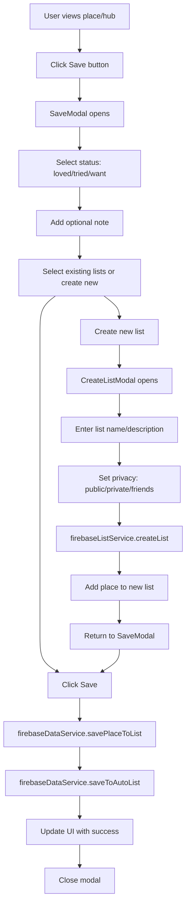
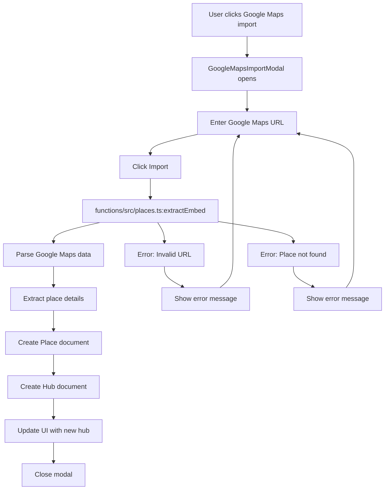
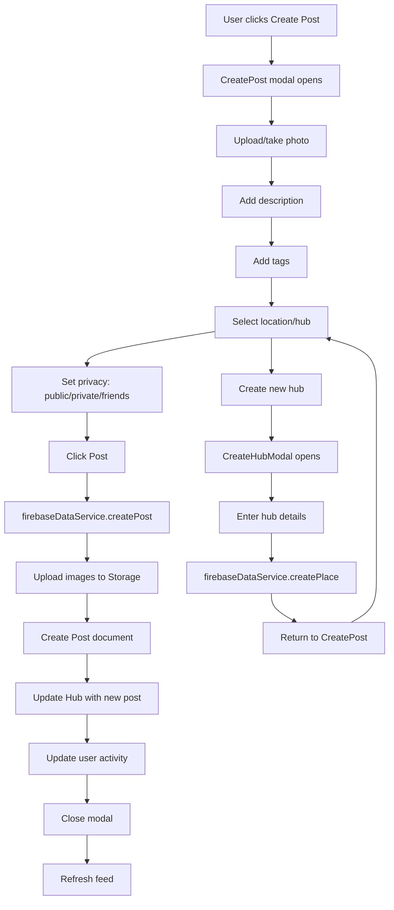
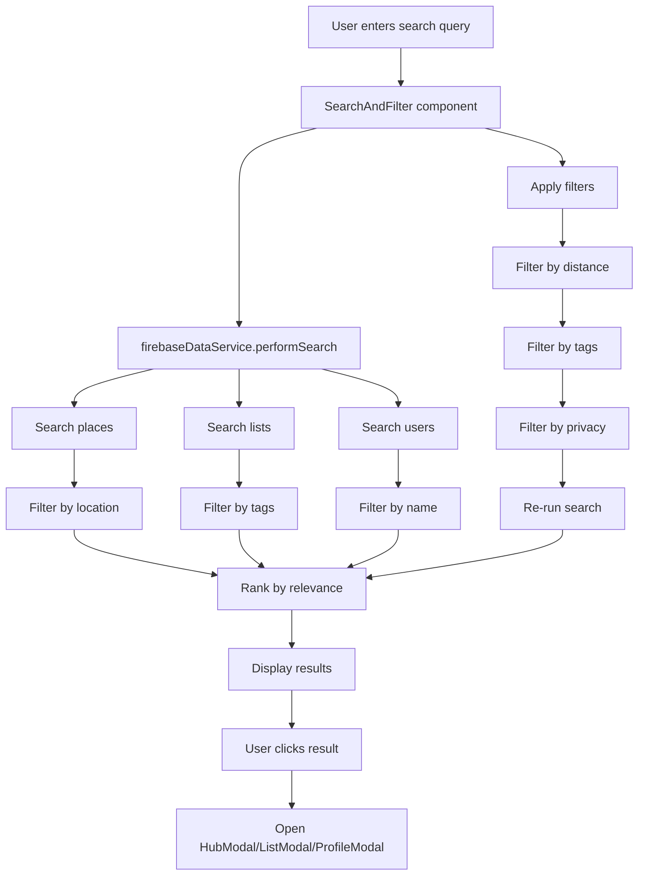
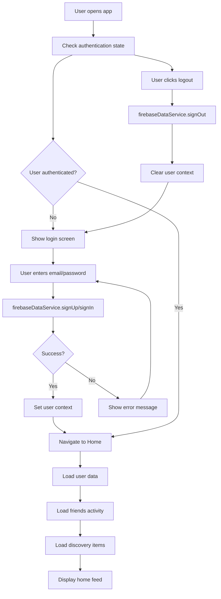
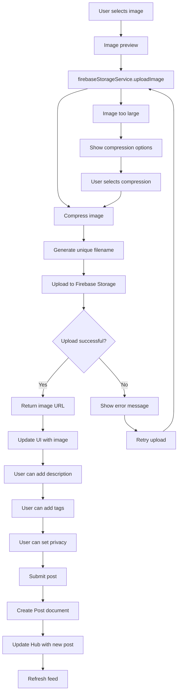
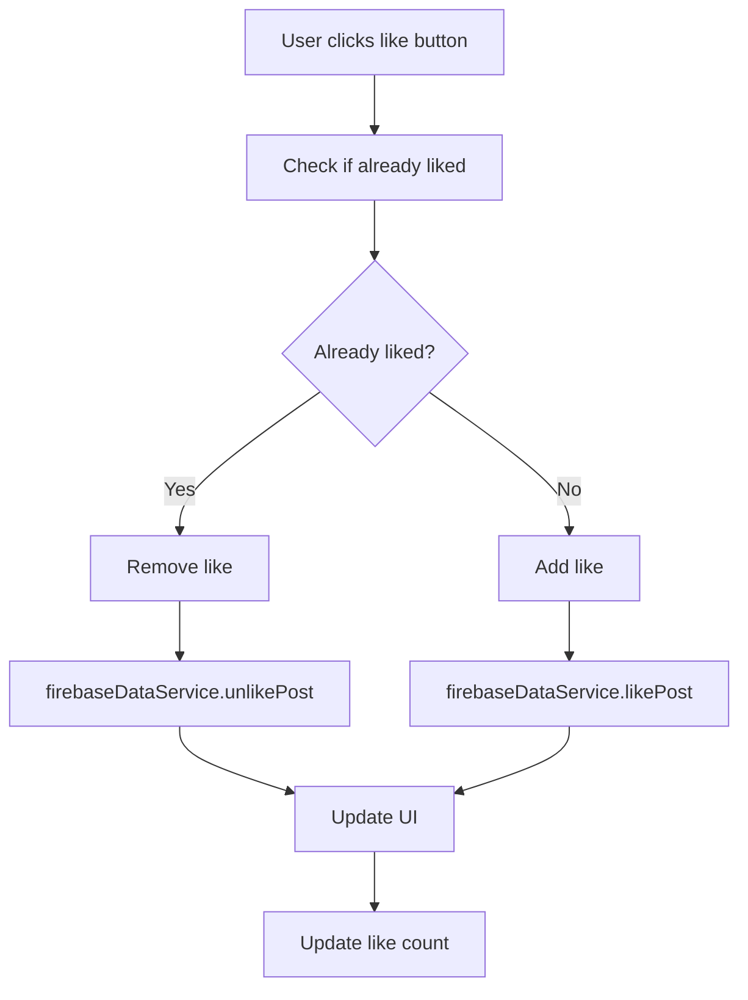
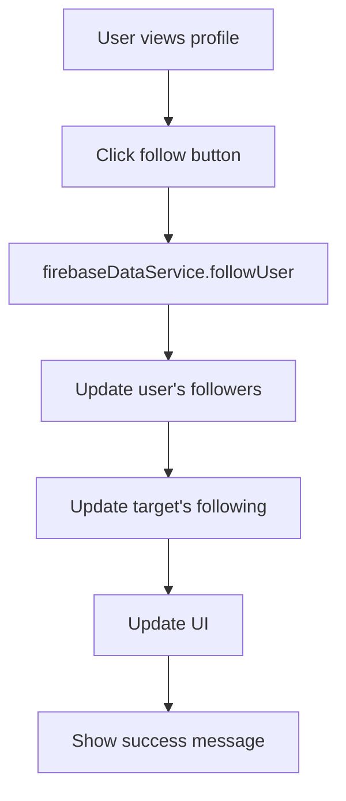
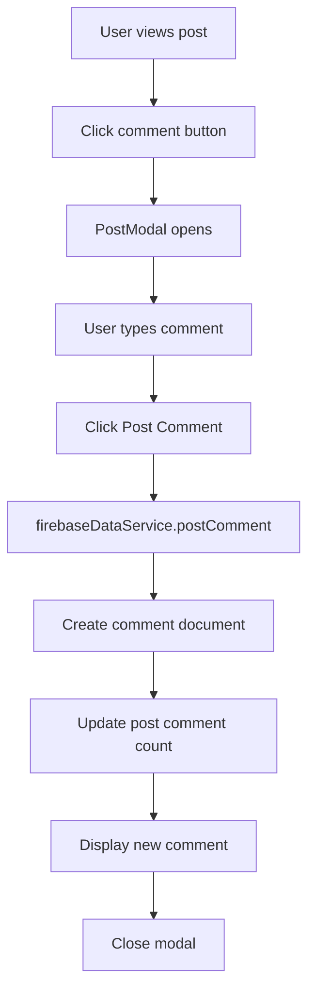

# User Flows

## Save→List Flow



**Handler Files:**
- `src/components/SaveModal.tsx:1-200` - Save modal UI and logic
- `src/services/firebaseDataService.ts:200-300` - savePlaceToList function
- `src/services/firebaseListService.ts:100-200` - createList function
- `src/components/CreateListModal.tsx:1-100` - Create list modal

## Promote Google→Hub Flow



**Handler Files:**
- `src/components/GoogleMapsImportModal.tsx:1-200` - Import modal UI
- `functions/src/places.ts:1-100` - extractEmbed Cloud Function
- `src/services/firebaseDataService.ts:300-400` - Place creation logic

## Create Post Flow



**Handler Files:**
- `src/components/CreatePost.tsx:1-300` - Create post modal
- `src/services/firebaseDataService.ts:400-500` - createPost function
- `src/services/firebaseStorageService.ts:1-100` - Image upload
- `src/components/CreateHubModal.tsx:1-200` - Create hub modal

## Global Search Flow



**Handler Files:**
- `src/components/SearchAndFilter.tsx:1-200` - Search UI component
- `src/services/firebaseDataService.ts:500-600` - performSearch function
- `src/utils/searchAlgorithm.ts:1-100` - Search ranking logic
- `src/utils/intelligentSearchService.ts:1-100` - AI search integration

## Search-in-List Flow

```mermaid
graph TD
    A[User opens ListView] --> B[Display list places]
    B --> C[User enters search query]
    C --> D[Filter places in list]
    D --> E[Display filtered results]
    E --> F[User clicks place]
    F --> G[Open HubModal]
    G --> H[Show place details]
    H --> I[User can save to other lists]
    
    C --> J[Clear search]
    J --> B
    
    E --> K[No results found]
    K --> L[Show "No places found" message]
    L --> C
```

**Handler Files:**
- `src/pages/ListView.tsx:1-200` - List view page
- `src/components/ListCard.tsx:1-300` - List display component
- `src/services/firebaseListService.ts:200-300` - getPlacesForList function

## Auth Flow



**Handler Files:**
- `src/contexts/AuthContext.tsx:1-200` - Authentication context
- `src/services/firebaseDataService.ts:100-200` - Auth functions
- `src/pages/Home.tsx:1-100` - Home page with auth checks

## Upload Flow



**Handler Files:**
- `src/services/firebaseStorageService.ts:1-200` - Image upload service
- `src/components/CreatePost.tsx:200-300` - Image upload UI
- `src/services/firebaseDataService.ts:400-500` - Post creation logic

## Additional Flows

### Like/Unlike Flow


**Handler Files:**
- `src/components/PostModal.tsx:200-300` - Like button logic
- `src/services/firebaseDataService.ts:600-700` - Like/unlike functions

### Follow/Unfollow Flow


**Handler Files:**
- `src/components/ProfileModal.tsx:1-200` - Profile display
- `src/services/firebaseDataService.ts:700-800` - Follow/unfollow functions

### Comment Flow


**Handler Files:**
- `src/components/PostModal.tsx:300-400` - Comment UI
- `src/services/firebaseDataService.ts:800-900` - Comment functions